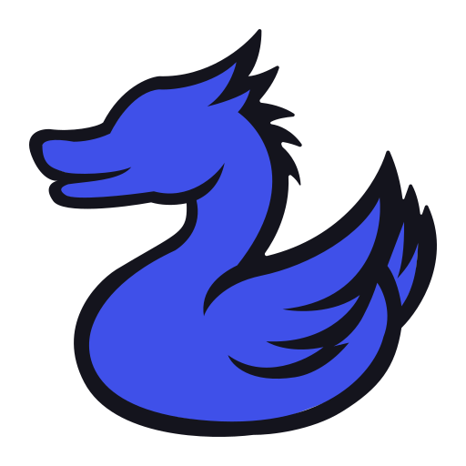

---

   

   <h3 align="center">drgn.dk</h3>

   

      Some awesome source code for my personal website!
       
       
      <a href="https://drgn.dk/">Visit Website</a>
      ·
      <a href="https://github.com/drgndk/drgn.dk/issues/new?assignees=&labels=bug&projects=&template=bug-report---.md">Report a Bug</a>
      ·
      <a href="https://github.com/drgndk/drgn.dk/issues/new?assignees=&labels=bug&projects=&template=feature-request---.md">Request a Feature</a>
   

   
Table of Contents

   <ol>
      <li>
         <a href="#about-the-project">About The Project</a>
         <ul>
            <li><a href="#built-with">Built With</a></li>
         </ul>
      </li>
      <li>
         <a href="#to-do">To-Do</a>
         <ul>
            <li><a href="#core-functions-priority">Core Functions</a></li>
            <li><a href="#frontend">Frontend</a></li>
            <li><a href="#backend">Backend</a></li>
            <li><a href="#optimization">Optimization</a></li>
            <li><a href="#security">Security</a></li>
         </ul>
      </li>
      <li><a href="#contributing">Contributing</a></li>
      <li><a href="#license">License</a></li>
      <li><a href="#contact">Contact</a></li>
      <li><a href="#acknowledgments">Acknowledgments</a></li>
   </ol>

## About The Project

**[drgn.dk](https://drgn.dk)** is a simple, yet powerful website.

This Website should act as an hub for future projects, as well as a place to showcase my work.

Some files are not included in this repository, because they might contain sensitive information.  
This includes all my `app/modules`, as long they are in WIP state.  
With enough creativity, you can probably figure out how everything missing is supposed to work.

### Built With

- [PHP 8.3.11](https://php.net)
- [SASS 1.77.8](https://sass-lang.com)

## To-Do

Future plans and goals for the project:

### Core Functions **(Priority)**
   - [x] Proper README.md (used this [Template](https://github.com/othneildrew/Best-README-Template), with slight modifications)
   - [ ] Documentation
   - [ ] Modules
      - [ ] (better) Routing System
      - [ ] Cache System
      - [ ] File System
      - [ ] Logging
      - [ ] Crypto
      - [ ] String

### Frontend
   - [ ] Finish Styling
   - [ ] Static sites (Home, About, Contact, ...)

### Backend
   - [ ] Better Error handling
   - [ ] User config

### Optimization
   - [ ] Minify Resources
   - [ ] Image Optimization
   - [ ] Caching

### Security
   - [x] (better?) Rate limiting
   - [x] Secruity Headers

## Contributing

If you have a suggestion that would make this better, please open an issue with the tag "enhancement".

Since modules are still missing, Pull Request should be avoided for now.

## License

This project is licensed under the Unlicense - see the [LICENSE](LICENSE) file for details.

TLDR; you can do whatever you want with this code, it's public domain.

## Acknowledgments

- [Best README Template](https://github.com/othneildrew/Best-README-Template)
   - For the README and Issue templates

## Contact

Twitter/X [@drgndk](https://twitter.com/drgndk)  
Email: [pz@drgn.dk](mailto:pz@drgn.dk)

(<a href="#readme-top">back to top</a>)

